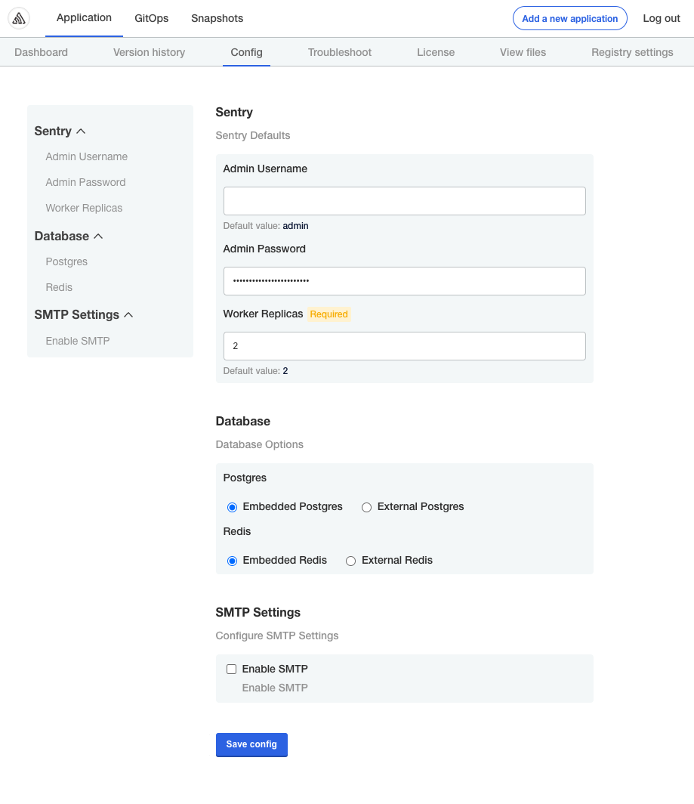

# About the Configuration Screen

Applications can include a configuration screen in the Replicated admin console to collect required or optional values from your users that are used to run your application.

For more information about how to add custom fields to the configuration screen, see [Creating and Editing Configuration Fields](admin-console-customize-config-screen).

If you use a Helm chart for your application in Replicated, your users provide any values specific to their environment from the configuration screen, rather than in a Helm chart `values.yaml` file.

This means that your users can provide configuration values through a user interface, rather than having to edit a YAML file or use `--set` CLI commands. The admin console configuration screen also allows you to control which options you expose to your users.

For example, you can use the configuration screen to provide database configuration options for your application. Your users could connect your application to an external database by providing required values in the configuration screen, such as the host, port, and a username and password for the database.

Or, you can also use the configuration screen to provide a database option that runs in the cluster as part of your application. For a tutorial of this use case, see [Tutorial: Adding Database Configuration Options](tutorial-adding-db-config).

## Viewing the Configuration Screen

If you include a configuration screen with your application, users of your application can access the configuration screen from the admin console:
* During application installation.
* At any time after application installation on the admin console Config tab.

For information about how to create the configuration screen for your application, see [Creating and Editing Configuration Fields](admin-console-customize-config-screen).

### Application Installation

The admin console displays the configuration screen when the user installs the application, after they upload their license file.

### Admin Console Config Tab

Users can access the configuration screen any time after they install the application by going to the Config tab in the admin console.

